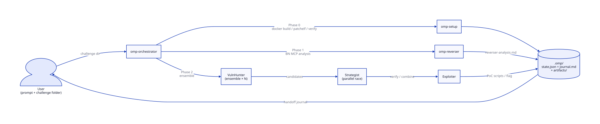

# oh-my-pwn (OmP)

> **CTF pwnable 자동 솔버 multi-agent harness — 독립 opencode 플러그인**

CTF 챌린지의 binary 와 Dockerfile 한 쌍만 주면 envsetup → 역분석 → 취약점 헌팅
→ exploit 단계를 LLM agent 들이 자동으로 돌립니다. 사람은 언제든 prompt
채널로 개입해서 교정 가능. 결과물은 `<challenge-dir>/.omp/` 안에
`state.json`, `journal.md`, 역분석 보고서, PoC 스크립트로 누적됩니다.

> [!IMPORTANT]
> Reverser agent 는 **Binary Ninja** GUI + BN MCP plugin 을 사용합니다.
> BN 은 상용 소프트웨어 — **Personal 라이센스 ($299+) 이상 필요**.
> BN Free 의 plugin / MCP 호환은 미검증. 라이센스 없이 돌리려면
> Reverser 를 비활성화하고 사용자가 직접 역분석 결과를
> `<challenge-dir>/.omp/artifacts/reverser-analysis.md` 에 채워주는 길도
> 있지만, 본 harness 의 default flow 가 아님.

## 한 눈에 보는 파이프라인



## Prerequisites

| 항목 | 버전 / 비고 |
|---|---|
| Linux (x86_64) | 다른 OS / arch 미검증 |
| [bun](https://bun.sh) | plugin install + build + test |
| Docker | 챌린지 image 빌드 + remote 재현 |
| [patchelf](https://github.com/NixOS/patchelf) | `apt install patchelf` |
| [opencode](https://github.com/opencode-ai/opencode) CLI | TUI |
| Binary Ninja (Personal+) | Reverser 가 사용. GUI 가 켜져 있어야 함. |
| [BN MCP plugin (fork)](https://github.com/youner119/binary_ninja_mcp) | `~/Tools/binary_ninja_mcp/` 에 clone + symlink 로 활성 |
| [pwno-mcp (fork)](https://github.com/youner119/pwno-mcp) | GDB inspection container. `~/Tools/pwno-mcp/` |

## 빠른 시작

```bash
# 1. (한 번) repo clone + 세팅. 다음을 한 번에 진행한다:
#    - bun install
#    - bun run build:plugin → dist/plugin.js 생성
#    - ~/.config/omp/opencode/opencode.json 자동 생성
#    - zshrc 에 `omp` alias 추가
./scripts/setup-omp.sh

# 2. 새 shell 에서 alias 활성화
exec zsh

# 3. Binary Ninja GUI 실행 → Plugins → BN MCP 활성 → port 9009 listen 확인
curl -sf http://localhost:9009/status

# 4. (선택) pwno-mcp container — Exploiter Mode 2 (GDB inspection) 가 필요할 때
docker run -d --name pwno-mcp ghcr.io/pwno-io/pwno-mcp:latest

# 5. challenge 폴더 안에서 OmP 전용 opencode TUI 실행
cd /path/to/challenge   # 안에 binary + Dockerfile 이 있어야 함
omp
```

opencode agent picker 에서 `omp-orchestrator` 선택 → prompt 로 "challenge 풀어줘" 같이 자연어로 지시 → orchestrator 가 setup → reverser → VH → SA → exploiter 단계를 진행.

## 한 번 돌릴 때의 흐름

1. **Load** — `omp_load_challenge` 가 binary + Dockerfile 을 검증하고 `.omp/{state.json, journal.md}` 를 만든다.
2. **Setup** — `omp-setup` agent 가 docker build, NEEDED libs 추출, patchelf, host/container runtime verify 까지 6 phase 를 진행. `setup_complete: true` 가 게이트.
3. **Reverse** — `omp-reverser` agent 가 BN MCP 로 함수별 pseudocode + 의미 분석 + 구조체 타입 추론 → `reverser-analysis.md` + `reverser-research.{en,ko}.md` + `pseudocode/*.txt` 산출.
4. **VulnHunt (ensemble)** — VulnHunter N개 instance 가 병렬로 후보를 뽑고 orchestrator 가 dedup → `vuln_candidates[]`.
5. **Strategy + Exploit (race)** — Strategist N개가 race 로 verify / combine task 를 진행하면서 Exploiter 를 spawn. PoC 스크립트가 `.omp/exploit/` 에 쌓이고 leaks / shell / flag 가 state 에 기록됨.
6. **Handoff** — `journal.md` 가 append-only 진행 보고. 사용자는 prompt 채널로만 교정 (`omp-orchestrator` 가 그 교정을 state mutation 으로 변환).

## 산출물 (`<challenge-dir>/.omp/`)

```
.omp/
├── state.json                # ChallengeState — 모든 agent 의 single source of truth
├── journal.md                # append-only 진행 보고
├── artifacts/
│   ├── prob                  # patched binary
│   ├── libc.so.6, ld-*.so.2, ...  # NEEDED libs (extracted)
│   ├── reverser-analysis.md
│   ├── reverser-research.md / .ko.md
│   └── pseudocode/*.txt      # BN HLIL dumps
├── exploit/*.py              # PoC / final exploit
└── logs/
    ├── docker-build-*.log
    ├── orchestration.log
    └── agents/*.json         # subagent transcript per task
```

## 사용 화면

> _Screenshot placeholder — opencode TUI 에서 `omp-orchestrator` 선택 + 진행 중인 화면. 직접 첨부 예정._
>
> 

## 현재 상태 (2026-05-20)

- ✅ **BN 전환** 완료 — Ghidra → Binary Ninja MCP. 모든 reverser flow 가 BN HLIL 기반.
- ✅ **병렬 orchestration** 완료 (2026-05-18 cutover). 4-tool subagent surface (`omp_task_launch` / `wait_all` / `wait_any` / `cancel`) 사용.
- ✅ **envsetup 재설계** 완료 (2026-05-20, T01–T20 archive). `omp-setup` agent 가 classification + envsetup + stage + pwno sanity + runtime verify 전 phase 를 담당. Legacy `runEnvSetup` 라이브러리 삭제.
- ✅ **T18 실측 통과** — `test_challenge/Object_Object` (Ubuntu 24.04 / glibc 2.39 / NEEDED 5) 4차 통과.

### 알려진 한계

- 🚨 **Exploiter Mode 2 (pwno-mcp GDB inspection) 미해결** — pwncli framework 의 `/attach` payload 가 `session_id` 누락 → HTTP 422. Mode 1 (host pwntools, stdout-only) 만 안정. 상세: `.omc/research/pwno-mcp-debugging-investigation.md`.
- ❌ **Kernel CTF 미지원** — `omp-setup` 이 vmlinux / bzImage / `qemu-system-*` 감지 시 `unsupported` 로 stop. 사용자가 직접 셋업해야 함. 향후 pwno-mcp fork 에서 per-docker + kernel tool 추가 예정.
- ❌ **Library-only / multi-binary / source-only / browser** 챌린지 미지원 — 동일하게 `unsupported`.
- ⚠️ **다른 챌린지 실측 미진행** — Object_Object 외 회귀 안 됨. NEEDED set / static / 다양한 binary 형태에서 재현은 future work.

## 문서

전반적 이해는 **[docs/README.md](docs/README.md)** 부터.

- [docs/architecture.md](docs/architecture.md) — plugin 구조, config/tool hook, 빌드/배포
- [docs/agents.md](docs/agents.md) — agent 설계, factory 패턴, prompt 구성 원칙
- [docs/state-and-io.md](docs/state-and-io.md) — `.omp/` 레이아웃, 상태 관리, human intervention
- [docs/tools.md](docs/tools.md) — `omp_*` tool 14개 (load/state·io 6 + subagent surface 4 + omp-setup atomic 4)
- [docs/templates.md](docs/templates.md) — 재사용 가능 템플릿 시스템
- [docs/development.md](docs/development.md) — 개발 환경 / 빌드 / 테스트 workflow

상세 spec / 결정 reasoning:

- `.omc/specs/` — Deep Interview crystallized spec (envsetup 재설계, exploit pipeline, parallel orchestration, BN transition, knowledge integration)
- `.omc/state/current-task.md` — 현재 진행 상황 (세션 연속성)
- `.omc/state/prev-task.md` — 완료된 작업 아카이브 (envsetup 재설계 T01-T20 포함)
- `.omc/decisions.md` — docs / spec 에 없는 architectural reasoning

## License

[MIT](LICENSE)
