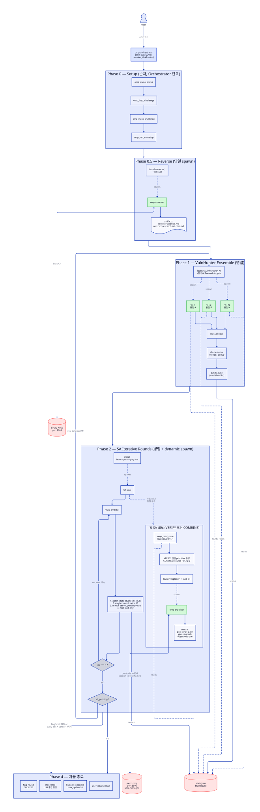

# Architecture — OmP가 opencode 플러그인으로 동작하는 방식

이 문서는 OmP가 **어떻게** opencode에 꽂혀서 agent를 노출하고, tool을
등록하고, MCP를 연결하는지 end-to-end로 설명합니다.

---

## 한 줄 요약

OmP는 `@opencode-ai/plugin` 인터페이스를 구현한 **단일 TypeScript 플러그인**
파일 (`src/plugin.ts`)입니다. `bun build`로 `dist/plugin.js` 번들 1개를
생성하고, opencode가 `~/.config/omp/opencode/opencode.json`의 `file://`
경로로 이 번들을 로드합니다. 플러그인이 실행되면 opencode의 `config`, `tool`
hook을 통해 agent / tool / MCP를 주입합니다.

---

## 병렬 작동 + 에이전트 흐름 (자율 모드 기준)



- Phase 0/0.5 = 순차 (Setup → Reverse)
- Phase 1 = VulnHunter ensemble 병렬 (`launch × N → wait_all`)
- Phase 2 = SA iterative rounds (`wait_any` race + record-then-launch invariant)
  - 구 spec의 Phase 3 (Result Collection + Cascading) 은 `REC` 박스 4-step으로 흡수됨
- `vh_pending` flag + `ids === []` 조건으로 deferred VH 재진입 (Pattern 4b)
- Phase 4 = 자율 종료 4-조건

Source: [`images/parallel-flow.d2`](images/parallel-flow.d2). 갱신: `d2 --layout=elk docs/images/parallel-flow.d2 docs/images/parallel-flow-d2.svg`.

---

## opencode 플러그인 인터페이스란

opencode는 TUI-기반 agent 런타임으로, 외부 플러그인을 JavaScript/TypeScript
모듈 형태로 로드할 수 있습니다. 플러그인은 `@opencode-ai/plugin` 패키지의
`Plugin` 타입을 구현한 **함수**입니다:

```ts
import type { Plugin } from "@opencode-ai/plugin"

const MyPlugin: Plugin = async (_input) => {
  return {
    // 각 hook은 opencode의 lifecycle 시점에 호출됨
    config: async (cfg) => { /* cfg 변형 */ },
    tool: { /* tool 정의 map */ },
    // 기타 hooks: "chat.message", "event", "tool.execute.before" 등
  }
}

export default MyPlugin
```

opencode의 플러그인 시스템은 10개 정도의 standard hook을 제공합니다
(`config`, `tool`, `chat.message`, `tool.execute.before`, `tool.execute.after`,
`event`, 등). 각 hook은 특정 lifecycle 시점에 플러그인이 config를 바꾸거나,
tool을 추가하거나, side effect를 실행할 기회를 줍니다.

OmP는 현재 **`config` hook + `tool` map**만 사용합니다. 나머지 hook은
필요해지면 도입 예정 (예: `event` hook을 쓰는 handoff journal writer는 T19
작업 시점에 추가될 수 있음).

---

## OmP의 `plugin.ts` 구조

`src/plugin.ts`는 약 60줄의 작은 파일입니다. 구성:

### 1. `config` hook — agent + MCP 주입

```ts
config: async (cfg) => {
  // 1-1. 기본 agent 비활성화
  cfg.agent ??= {}
  cfg.agent.build = { disable: true }
  cfg.agent.plan = { disable: true }

  // 1-2. OmP agent들 주입
  Object.assign(cfg.agent, ompAgentConfigs)

  // 1-3. BN MCP 등록 (OMP_BN_BRIDGE_PATH env var로 설정)
  const bridgePath = process.env["OMP_BN_BRIDGE_PATH"]
  if (bridgePath !== undefined && existsSync(bridgePath)) {
    cfg.mcp ??= {}
    cfg.mcp["bn"] = {
      type: "local",
      command: ["node", bridgePath],
      enabled: true,
    }
  } else {
    // env var 없거나 파일 부재 → stderr 경고 + MCP 등록 skip
  }

  // 1-4. pwno-mcp 는 plugin 이 주입하지 않음 — opencode.json 의 정적
  //      mcp.pwno-mcp entry (stdio docker) 가 박혀있고 opencode 가 자동
  //      spawn. setup-omp.sh 가 그 entry 를 박는다.
}
```

**주요 포인트:**
- opencode의 기본 `build` / `plan` agent는 OmP 환경에서 쓸 일이 없어서
  `disable: true`로 숨김. TUI agent picker에 OmP agent만 보이게.
- `ompAgentConfigs`는 `src/agents/definitions.ts`에 정의된 agent registry
  (자세한 내용은 [agents.md](agents.md)).
- **BN MCP:** `OMP_BN_BRIDGE_PATH` 환경변수로 설정. stdio 모드
  (Node.js bridge subprocess — `node dist/index.js`). Reverser가 사용.
  `setup-omp.sh`가 `~/Tools/binary_ninja_mcp/` 경로에서 자동 탐지.
  BN HTTP plugin이 port 9009에서 실행 중이어야 연결됨 (`OMP_BN_PORT` 기본 9009).
  **v2.0.0 multi-session 모델 (2026-05-21~):** 모든 MCP tool 이 `view_id`
  필수. Reverser 가 challenge 별 view (alias = `basename(state.challenge_dir)`)
  를 `create_view` 로 박고 모든 호출에 forward. legacy `_current_view` 전역
  영역 제거 — `get_binary_status` / `load_binary` / `list_binaries` /
  `select_binary` 도 폐기 (`list_view` / `create_view` / `delete_view` 가
  대체). Fork: `youner119/binary_ninja_mcp`.
- **pwno-mcp:** **opencode-managed stdio docker container.** `~/.config/omp/opencode/opencode.json`
  의 정적 `mcp.pwno-mcp` entry (`docker run --rm -i ... pwno-mcp:latest --stdio`) 가
  박혀있고 opencode 가 첫 MCP tool 호출 시점에 자동 spawn, opencode 종료 시
  `--rm` 으로 자동 정리. plugin code 는 pwno MCP 영역 안 박음. 사용자가
  manual docker run 단계 없음. Exploiter Mode 2 가 gdb breakpoint /
  memory / register / heap 관찰에 사용. 영역: 2026-05-21 stdio 전환
  (이전 HTTP remote `http://127.0.0.1:5500/mcp` 영역 폐기) + debuginfod
  wedge resolved (fork commit `3794c4f`).

### 2. `tool` map — OmP plugin tool 12개 등록 (+ 별개 DB MCP 11개)

```ts
tool: {
  omp_load_challenge: ompLoadChallengeTool,        // workspace_root 시드 (non-DB, T20)
  omp_append_journal: ompAppendJournalTool,
  omp_get_template: ompGetTemplateTool,
  omp_verify_template_output: ompVerifyTemplateOutputTool,
  // 4-tool 병렬 인프라 (2026-05-18 cutover):
  omp_task_launch: ompTaskLaunchTool,             // fire-and-forget sub-agent spawn → {task_id, session_id}
  omp_task_wait_all: ompTaskWaitAllTool,          // 모두 terminal까지 block, 입력 순서 results[]
  omp_task_wait_any: ompTaskWaitAnyTool,          // 첫 완료자 + remaining_ids (race + dynamic spawn)
  omp_task_cancel: ompTaskCancelTool,             // 멱등 abort RPC + status=cancelled + emit("done")
  // omp-setup agent atomic 4개 (envsetup 재설계 — T04/T06/T07/T08):
  omp_setup_docker_build: ompSetupDockerBuildTool,    // Phase 1
  omp_setup_extract_file: ompSetupExtractFileTool,    // Phase 3 image + Phase 5 host
  omp_setup_patch_elf: ompSetupPatchElfTool,          // Phase 3 + Phase 5 (--replace-needed)
  omp_setup_verify_runtime: ompSetupVerifyRuntimeTool, // Phase 4 host + Phase 5 container
}
```

**state / candidate / challenge tool 은 plugin 이 아님** — database-mcp cutover
(2026-06) 로 별개 DB MCP server `omp-db` (stdio) 의 `mcp__omp-db__*` 11 tool
(read/patch_state + read/create/patch/delete_candidate + register/lookup/read/
update/delete_challenge) 로 이전. 옛 plugin `omp_{read,patch}_state` /
`omp_*_candidate` 6개 폐기. opencode 가 `opencode.json` 의 `mcp.omp-db` entry 로
자동 spawn (`docs/database.md`).

폐지된 legacy tool (T12-T14 — `omp_run_envsetup` / `omp_pwno_status` /
`omp_stage_challenge`) 의 책임은 omp-setup agent (Phase 1-5) 가 흡수.

plugin tool 은 **session 레벨**로 등록됩니다. Per-agent tool 제한은 **ACL 2 layer**
로 구현 — (L1) `agent-tool-restrictions.ts` 가 sub-agent 의 write tool surface
제거 + (L2) `db-mcp/acl.ts` 의 `agent_id` allowlist server-side 강제.

> **병렬 인프라 tool (계획 중):** OmO의 `delegate-task` tool 패턴을 포팅하여
> Orchestrator가 병렬로 sub-agent를 spawn하는 `task` tool + background output
> 조회 tool을 추가 예정. 이 tool들은 `session.create(parentID)` +
> `session.promptAsync()` API 기반으로 동작.
> Spec: `.omc/specs/deep-interview-parallel-orchestration.md`

각 tool의 상세는 [tools.md](tools.md) 참조.

---

## opencode에 로드되는 방식

OmP는 `omp`라는 쉘 alias로 실행됩니다. alias는 `setup-omp.sh`가
`~/.zshrc`에 다음과 같이 추가합니다:

```bash
alias omp="OMP_BN_BRIDGE_PATH='/abs/path/to/binary_ninja_mcp/dist/index.js' XDG_CONFIG_HOME='$HOME/.config/omp' opencode"
```

이 alias는:

1. **`OMP_BN_BRIDGE_PATH` env var**를 현재 머신에서 탐지한 BN MCP
   bridge 경로로 설정 (플러그인이 BN MCP 등록 시 참조)
2. **`XDG_CONFIG_HOME`을 별도 디렉토리로 override** — 기존 `opencode` 명령이
   쓰는 `~/.config/opencode`와 완전히 분리. OmO(원래 `opencode`)와
   간섭 0.
3. **그 상태로 `opencode` 바이너리 실행**

opencode가 시작되면서 `$XDG_CONFIG_HOME/opencode/opencode.json`을 읽습니다:

```json
{
  "$schema": "https://opencode.ai/config.json",
  "plugin": ["file:///mnt/D/Data/Work/oh-my-pwn/dist/plugin.js"]
}
```

이 `plugin` 배열의 `file://` 경로가 OmP의 빌드 산출물입니다. opencode는
`dist/plugin.js`를 동적으로 import하고, default export인 `OmpPlugin`
함수를 호출해서 위에서 설명한 hook들을 돌립니다.

**결과:** opencode TUI에 OmP agent들이 picker 목록에 나타나고,
OmP tool들이 session 레벨로 활성화되고, BN MCP가 연결 대기 상태가 됨.

---

## 데이터 흐름 도식

```
사용자
  ↓ (CLI / TUI)
opencode (omp alias, XDG_CONFIG_HOME=~/.config/omp)
  ↓ opencode.json 읽기
  ↓ file:// 로 dist/plugin.js 로드
  ↓ OmpPlugin() 호출
  ↓
  ├── config hook → cfg.agent에 11 agent 주입 (orchestrator + setup + reverser + vulnhunter + strategist + exploiter-mode-{0,1,2,9} + mode-{1,2}-gpt)
  │                 cfg.mcp에 binja MCP 등록 (pwno-mcp / omp-db 는 opencode.json 정적 entry — opencode 가 stdio spawn)
  │
  └── tool map → 12개 plugin omp_* tool을 session 레벨로 노출 (load + journal + template 2 + task 4 + omp_setup_* 4). state/candidate/challenge 는 별개 DB MCP omp-db (mcp__omp-db__* 11)
  ↓
TUI agent picker → 사용자가 omp-orchestrator 선택
  ↓
Orchestrator agent 시작
  ↓
Stage 1: Load + EnvSetup + Reverse (순차)
  ↓
Stage 2: VulnHunter ensemble (병렬)
  ├─ VH-1 ──┐
  ├─ VH-2 ──┼→ Orchestrator merge/dedup → candidate list → state 기록
  └─ VH-N ──┘
  ↓
Stage 3: Strategy+Exploit (iterative rounds, state.db = blackboard)
  Round 1:
  ├─ SA-1 (VERIFY A) → Exploiter-1 (session_id=1) ──┐
  ├─ SA-2 (VERIFY B) → Exploiter-2 (session_id=2) ──┼→ Orchestrator 수집 → state 기록
  └─ SA-3 (VERIFY C) → Exploiter-3 (session_id=3) ──┘
  모두 동일한 pwno-mcp container (port 5500)
  Round N:
  └─ SA-N (COMBINE A+B) → Exploiter-N (session_id=N) → flag?
  * 임의 SA 성공 시 early-exit (나머지 취소)
  ↓
Stage 4: Cascading (조건부 재진입) 또는 종료
  ↓
<challenge-dir>/.omp/ 내부로 state/journal/artifacts 저장
  ↓
사용자가 journal.md / artifacts/ 읽고 판단, 필요하면 prompt로 correction
```

---

## 병렬 실행 아키텍처

> Spec: `.omc/specs/deep-interview-parallel-orchestration.md`

OmP의 병렬 agent 실행은 opencode 내장 기능이 아닌 **OmO(oh-my-openagent)의
자체 인프라 패턴을 포팅**해서 구현합니다.

### 메커니즘

```
Orchestrator (LLM)
  ├─ omp_task_launch(agent="vulnhunter", ...) → {task_id: t1, session_id}
  ├─ omp_task_launch(agent="vulnhunter", ...) → {task_id: t2, ...}
  └─ omp_task_launch(agent="vulnhunter", ...) → {task_id: t3, ...}
      ↑ 한 턴에 fire-and-forget 여러 번 → 동시 실행
  ↓
  omp_task_wait_all({task_ids: [t1, t2, t3]}) → {results: [...] 입력 순서}
```

내부적으로 (BackgroundManager):
1. `session.create({ parentID: orchestratorSessionID })` — 자식 세션 생성
2. `session.promptAsync({ agent: "omp-vulnhunter", parts: [prompt] })` — 비동기 실행
3. polling이 session "idle" 감지 → `task.status = "completed"` + `taskEvents.emit("done", task_id)`
4. wait_*가 state-first check (이미 terminal인 task 즉시 반환) + EventEmitter 구독으로 race 닫음
5. waitAll/waitAny가 outcome (output + status + error) Promise.all로 fetch해서 LLM에 반환

### Sole Writer 패턴

병렬 agent들의 state 동시 쓰기 충돌 방지 (+ ACL 2 layer server-side 강제):
- SA/Exploiter는 `mcp__omp-db__patch_state` **호출 금지** — 결과만 반환 (ACL deny)
- Orchestrator가 결과를 수집하여 **순차적으로** state 기록
- SA/Exploiter는 `mcp__omp-db__read_state`로 읽기만 가능

### opencode-managed pwno-mcp stdio container + session_id

모든 Exploiter 인스턴스가 **1개 Docker container를 공유**하며 session_id로 격리:
```
Exploiter-1 → pwno-mcp container (session_id=verify-vuln_1-r1)   ┐
Exploiter-2 → pwno-mcp container (session_id=verify-vuln_2-r1)   ├─ 동일 container (stdio)
Exploiter-3 → pwno-mcp container (session_id=combine-v1+v2-r2)   ┘
```
pwno-mcp가 session_id별로 GDB 프로세스를 격리 관리 (네이티브 multi-session).
port 분리 불필요 (stdio 전환 후 HTTP port 5500 영역 자체 폐기).

**Container lifecycle은 opencode 책임.** 2026-05-21 stdio 전환 후:
- `setup-omp.sh` 가 `~/.config/omp/opencode/opencode.json` 의
  `mcp.pwno-mcp` entry 를 박는다 — `docker run --rm -i --cap-add=SYS_PTRACE
  --cap-add=SYS_ADMIN --security-opt seccomp=unconfined --security-opt
  apparmor=unconfined -v $REPO_ROOT/workspace:/workspace -v
  omp-debuginfod-cache:/home/pwno/.cache/debuginfod_client pwno-mcp:latest --stdio`
- opencode runtime 이 첫 MCP tool 호출 시점에 자동 spawn, opencode 종료
  시 `--rm` 으로 자동 정리.
- 사용자 manual docker run 단계 없음. setup-omp.sh 끝에 docker run 명령
  출력 영역 폐기.
- container-manager 코드 부재. plugin code 가 pwno-mcp 주입 안 함.

`pwno-mcp:latest` 는 fork (`youner119/pwno-mcp` → `~/Tools/pwno-mcp/`) 의
local build (`./docker-build.local.sh`). debuginfod default off + cache
dir chown 영역 박혀 wedge resolved (CLAUDE.md 항목 11).

workspace mount source는 **repo root 의 `workspace/` 폴더로 고정** —
challenge별로 mount path를 바꾸지 않는다.

**Challenge 파일은 omp-setup agent 가 workspace 로 stage 한다.** Phase 0
에서 Orchestrator 가 omp-setup agent 를 launch 하면, agent Phase 5 가
`omp_setup_extract_file` (source="host") + `omp_setup_patch_elf` 로
`.omp/artifacts/` 의 patched binary + extracted libs 를
`<plugin-root>/workspace/<challenge_id>/` 로 복사하고 workspace 측
patchelf 한다. 컨테이너 안에서는 `/workspace/<id>/...` 로 접근.
`<challenge_id>` = `omp-<basename(challenge_dir)>-<sha8>` (derive 룰 —
별도 stored field 없음).

**session_id 작명은 Orchestrator 책임 (sole id-allocator):**
- `verify-<candidate_id>-r<round>` (VERIFY task)
- `combine-<id_A>+<id_B>-r<round>` (COMBINE task)

Sub-agent (SA/Exploiter)는 받은 session_id를 그대로 forward, 생성/수정
안 함.

Container health 는 omp-setup agent 가 Phase 5 sanity 단계에서 MCP tool
호출 시점에 자연 spawn 으로 확인 (별도 health check 없음 — stdio container
는 opencode 가 lifecycle 관리).

---

## 빌드 파이프라인

OmP는 **TypeScript로 작성되고 Bun으로 bundle**됩니다.

```bash
bun run build:plugin
# 내부적으로:
# bun build src/plugin.ts \
#   --outdir dist \
#   --target bun \
#   --format esm \
#   --external @opencode-ai/plugin \
#   --external @opencode-ai/sdk \
#   --external @modelcontextprotocol/sdk \
#   --external @anthropic-ai/sdk \
#   --external zod
```

**외부화된 의존성 (번들에 포함되지 않음):**
- `@opencode-ai/plugin` — opencode가 런타임에 제공
- `@opencode-ai/sdk` — 동일
- `@modelcontextprotocol/sdk` — MCP 프로토콜 구현체, opencode 런타임이 로드
- `@anthropic-ai/sdk` — 필요 시 opencode가 로드
- `zod` — schema validation, 런타임 로드

**번들되는 것:**
- `src/plugin.ts` 및 그로부터 import되는 모든 OmP 소스 파일
- `src/agents/*.ts` (agent factory + prompt 문자열)
- `src/tools/*.ts` (tool 정의)
- `src/state/*.ts` (ChallengeState, journal, io, layout)
- `src/loader/*.ts` (T03 challenge folder loader)
- `src/envsetup/*.ts` (T04 docker + ELF + patchelf)
- `src/templates/*.ts` (research report 템플릿)

결과물은 단일 `dist/plugin.js` 파일 (~130KB, 프로젝트 성장에 따라 증가).

### 코드 변경 후 workflow

```bash
# 1. 파일 수정 (예: src/agents/omp-reverser.ts 프롬프트 조정)

# 2. 타입 체크 + 테스트
bun run typecheck
bun test           # 전체 테스트 (전체 ~200 tests)

# 3. 플러그인 rebuild
bun run build:plugin

# 4. omp 재시작 (TUI에 자동 반영 안 됨 — 플러그인 캐싱 때문)
# TUI 종료 후 다시 `omp` 실행
```

**중요:** `omp` TUI 내부에서 코드 변경은 반영 안 됩니다. 파일 수정 →
build → 재시작 사이클이 강제입니다. `setup-omp.sh`는 이 rebuild + alias
갱신까지 한 방에 처리하므로, 큰 변경 후엔 그냥 `./scripts/setup-omp.sh`를
다시 돌려도 됩니다.

---

## 기존 `opencode` 명령과의 분리

```
~/.config/opencode/opencode.json   ← OmO (oh-my-openagent) 전용
~/.config/omp/opencode/opencode.json   ← OmP 전용
```

두 config 디렉토리는 `XDG_CONFIG_HOME` 분리로 완전히 격리됩니다.

| 명령 | XDG_CONFIG_HOME | 플러그인 |
|---|---|---|
| `opencode` | `~/.config` (기본) | OmO |
| `omp` | `~/.config/omp` (alias override) | OmP |

한 머신에서 두 도구를 나란히 써도 서로의 설정 / 히스토리 / MCP 연결을
건드리지 않습니다. 이 분리 덕분에 OmO 디버깅과 OmP 개발을 동시에 진행할 수
있습니다.

---

## setup 스크립트가 하는 일

`./scripts/setup-omp.sh`는 **현재 머신에서 OmP를 쓸 수 있게 만드는**
one-shot 스크립트입니다. Repo 위치가 바뀌었거나 새 머신에서 처음 쓸 때
이 스크립트 한 번이면 됩니다.

단계:

1. **Plugin build** — `bun run build:plugin` 실행 (`--no-build`로 skip 가능)
2. **BN bridge 탐지**
   - `--bn-bridge <path>` 명시 우선
   - 자동 glob `~/Tools/binary_ninja_mcp/dist/index.js`
   - 복수 매치 시 interactive 선택
   - 0 매치 시 interactive prompt (경로 입력 또는 Enter로 skip)
   - `--skip-bn`으로 명시 opt-out
3. **`opencode.json` 생성** — `$HOME/.config/omp/opencode/opencode.json`에
   현재 repo의 `dist/plugin.js`를 `file://` 경로로 등록
4. **zshrc alias 갱신** — 기존 `alias omp=` 가 있으면 awk로 교체, 없으면
   append. alias 내용:
   ```
   alias omp="OMP_BN_BRIDGE_PATH=<탐지경로> XDG_CONFIG_HOME=$HOME/.config/omp opencode"
   ```
5. **검증** — `opencode debug config`로 플러그인이 로드되는지 확인,
   OmP agent가 주입됐는지 grep

옵션:
- `--dry-run` — 변경 없이 계획만 출력
- `--no-build` — dist/plugin.js 재사용
- `--no-alias` — zshrc 건드리지 않음
- `--skip-bn` — bridge 설정 skip
- `--bn-bridge <path>` — bridge 경로 명시

---

## 관련 파일 요약

| 파일 | 역할 |
|---|---|
| `src/plugin.ts` | 플러그인 entry point. Config hook + tool map. |
| `src/agents/definitions.ts` | Agent registry (`ompAgentConfigs`). |
| `src/agents/omp-orchestrator.ts` | Orchestrator agent factory + prompt. |
| `src/agents/omp-reverser.ts` | Reverser agent factory + prompt. |
| `src/tools/*.ts` | plugin tool 12개 구현 (load + journal + template 2 + task 4 + omp_setup_* 4). |
| `src/db/` + `src/db-mcp/` | Drizzle schema + 별개 DB MCP server `omp-db` (state/candidate/challenge 11 tool + ACL 2 layer). |
| `src/templates/*.ts` | Agent가 tool로 로드하는 템플릿 string. |
| `scripts/setup-omp.sh` | 머신 세팅 one-shot 스크립트. |
| `~/.config/omp/opencode/opencode.json` | 플러그인 등록 파일 (사용자 config). |
| `dist/plugin.js` | 빌드 산출물. opencode가 로드하는 파일. |

다음 문서에서 **agent가 어떻게 만들어지는지** 더 자세히 다룹니다 →
[agents.md](agents.md).
